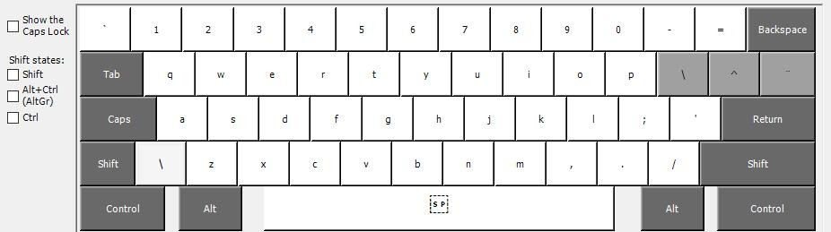
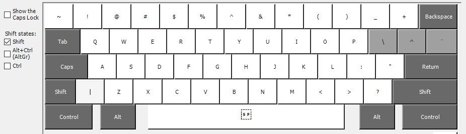
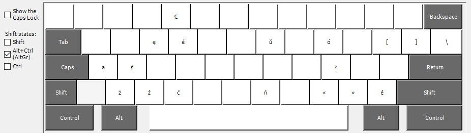
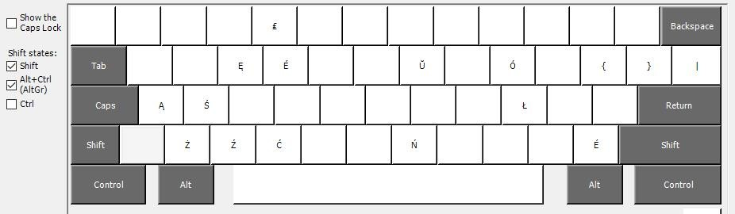

## Podstawowy układ:

Jedyne różnice względem polskiego układu to umieszczenie martwich klawiszy w miejscu <kbd>[</kbd>, <kbd>]</kbd> oraz <kbd>\ </kbd>. Martwe klawisze polegają na wciśnięciu najpierw takiego klawisza (kombinatora) a następnie literki, która ma być zmodyfikowana.

- <kbd>]</kbd> - dodaje [cyrkumfleks](https://pl.wikipedia.org/wiki/Akcent_przeci%C4%85g%C5%82y) ("daszek", "akcent przeciągły") – np. <kbd>]</kbd> <kbd>a</kbd> jest zamieniane na `â` (proszę zrwócić uwagę na brak `+` - guziki należy wciskać kolejno)
- <kbd>[</kbd> - dodaje [grawis](https://pl.wikipedia.org/wiki/Grawis) - np. <kbd>[</kdb><kbd>i</kbd> daje `ì`

- <kbd>\ </kbd> - dodaje [diarezę](https://pl.wikipedia.org/wiki/Diereza_(pisownia)) (umlaut) oraz tworzy pozostałe znaki francuskie - np. <kbd>[</kbd><kbd>i</kbd> daje `ï` - 
  - <kbd>[</kbd><kbd>c</kbd> daje `ç`
  - <kbd>[</kbd><kbd>a</kbd> daje `æ`
  - <kbd>[</kbd><kbd>o</kbd> daje `œ`

## Układ z <kbd>Shift</kbd>

Wszystko identycznie jak powyżej: budowane są wielkie litery.

Jedynie `~` działa za pierwszym razem. (To jest, nie można używać jej jako martwego klawisza do polskich znaków).

## Układ z <kbd>Alt</kbd>

W dodatku do polskich liter, pojawia się dodatkowo:

<kbd></kbd>
- `é` pod <kbd>Alt</kbd> + <kbd>r</kbd> (analogicznie do `ź`) oraz <kbd>Alt</kbd> + <kbd>/ </kbd> (dla wygody)
- `«` `»` cudzysłowy pod <kbd>Alt</kbd> + <kbd>,</kbd> oraz <kbd>Alt</kbd> + <kbd>.</kbd> (pasując do strzałki)
- `€` pod <kbd>Alt</kbd>+<kbd>5</kbd>
- klawisze <kbd>[</kbd>, <kbd>]</kbd> oraz <kbd>\ </kbd> odzyskują swoje znaczenie

## Układ z <kbd>Shift</kbd>+<kbd>Alt</kbd>

- `É` pod <kbd>Shift</kbd>+<kbd>Alt</kbd> + <kbd>r</kbd> (analogicznie do `Ź`) oraz <kbd>Shift</kbd>+<kbd>Alt</kbd> + <kbd>/ </kbd> (dla wygody)
- `£` pod <kbd>Shift</kbd>+<kbd>Alt</kbd>+<kbd>5</kbd>
- klawisze <kbd>{</kbd>, <kbd>}</kbd> oraz <kbd>|</kbd> odzyskują swoje znaczenie
